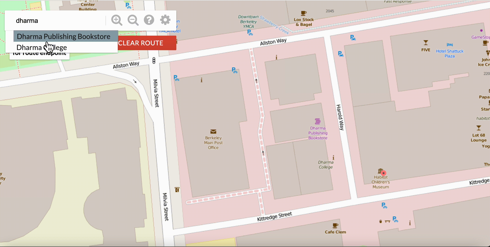

# BearMAPS

BearMaps is an interactive mapping web application that allows a user to navigate around the vicinity of the Berkeley downtown area in Berkeley, California.
I implemented the back-end "smart" features of this program including rastering, dragging/zooming, shortest path finding, auto-complete search and turn-by-turn directions. 

Data structures and algorithms such as Heap, Trie, K-D Tree and A* search were implemented from scratch in Java to learn object-oriented programming.

## Shortest path and Turn-by-turn directions

## Autocomplete

## Search and highlight

| File | Description                                                                                                                                                 |
|------|-------------------------------------------------------------------------------------------------------------------------------------------------------------|
|  [RasterAPIHandler](https://github.com/Emma003/CS61B/tree/main/proj2d/bearmaps/proj2d/server/handler/impl#:~:text=RasterAPIHandler.java)    | Renders map images given a user's requested area and level of zoom.                                                                                         |
|  [AugmentedStreetMapGraph](https://github.com/Emma003/CS61B/tree/main/proj2d/bearmaps/proj2d#:~:text=AugmentedStreetMapGraph.java)    | Graph representation of the contents of Berkeley Open Street Map data.                                                                                      |
|  [AStarSolver](https://github.com/Emma003/CS61B/tree/main/proj2c/bearmaps/proj2c#:~:text=2%20years%20ago-,AStarSolver.java,-puzzle%20solder%20done)    | The A* search algorithm to find the shortest path between two points in Berkeley.                                                                           |
|  [TrieSet](https://github.com/Emma003/CS61B/tree/main/proj2d/bearmaps/proj2ab#:~:text=2%20years%20ago-,TrieSet.java,-implemented%20every%20thing)    | A TrieSet backs the autocomplete search feature, matching a prefix to valid location names in Θ(k) time, where k in the number of words sharing the prefix. |
|  [KD Tree](https://github.com/Emma003/CS61B/tree/main/proj2ab/bearmaps#:~:text=4%20months%20ago-,KDTree.java,-done%20with%20proj2a)    | A K-Dimensional Tree backs the A* search algorithm, allowing efficient nearest neighbor lookup averaging O(log(n)) time.                                    |
|  [ArrayHeapMinPQ](https://github.com/Emma003/CS61B/tree/main/proj2ab/bearmaps#:~:text=.%E2%80%8A.-,ArrayHeapMinPQ.java,-puzzle%20solder%20done)    | A min-heap priority queue backs the A* search algorithm.
|  [Router](https://github.com/Emma003/CS61B/tree/main/proj2d/bearmaps/proj2d#:~:text=7%20hours%20ago-,Router.java,-implemented%20every%20thing)    | Creates the list of directions corresponding to a route on the graph

## Acknowledgements
Adapted from a project (mainly proj2) in UC Berkeley CS 61B Data Structures, Fall 2020, taught by Josh Hug.
